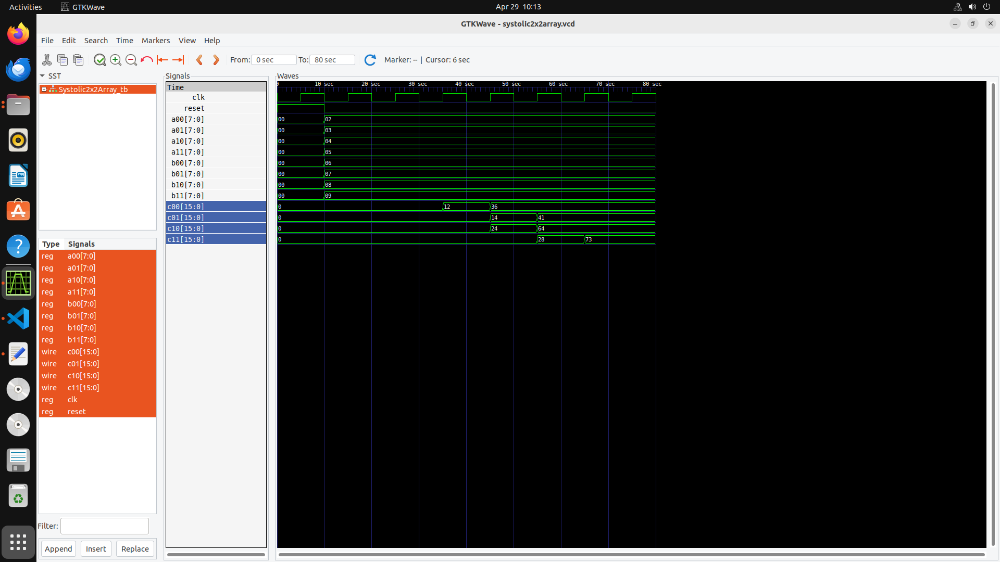

# 2×2 Systolic Array - Verilog Implementation

This project implements a simple 2×2 Systolic Array architecture using Verilog HDL.  
Systolic arrays are highly parallel hardware structures commonly used for matrix multiplication in applications like machine learning and signal processing.

## Features
- 2×2 Matrix Multiplication using Systolic architecture
- Modular Verilog design
- Simulation testbench included for verification

## Files Included
- `PE.v` — Verilog module for the basic processing element
- `Systolic2x2Array.v` — Top-level Verilog module connecting the processing elements
- `Systolic2x2Array_tb.v` — Testbench for simulation

## How to Run
1. Simulate using any Verilog simulator (such as ModelSim, Icarus Verilog, etc.).
2. Compile all Verilog files and run the testbench.
3. Verify the correctness of matrix multiplication outputs.

## Project Structure

├── processing_element.v 
├── systolic_array.v 
└── systolic_array_tb.v

## Demo

## Author
- [Charan Sai Mathkala](https://github.com/Cherry6547)

---

